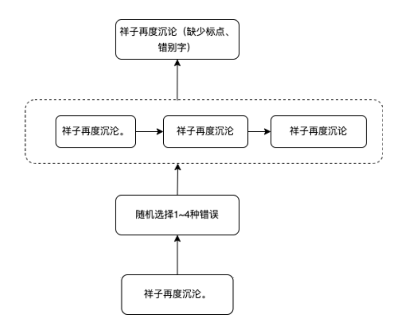

# 语法错误数据增强




### 文件目录说明
eg:

```
filetree 
├── README.md
├── cged_dat.py
├── config.py
├── /data/
│  ├── /dat_data/
│  │  ├── confuse_obj_v.json
│  │  ...
│  │  └── token_set.txt
├── /pre_model/
│  ├── /ltp_small/
│  │  

```

### 模型文件下载

pre_model下的ltp_small,下载地址：https://huggingface.co/LTP/small


